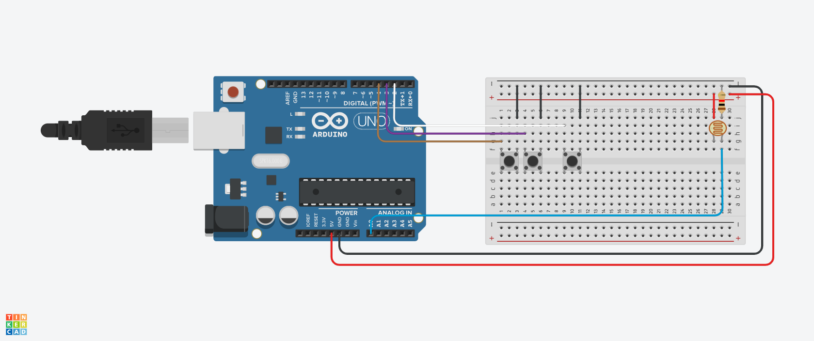

<h1 align = "center">
  Controle de Brilho de Monitor com Arduino e Linux
  
  <p align="center">
    
    
  </p>
</h1>

<p align ="center">
<a href= "#sobre-este-projeto">👨🏻‍💻 Sobre este projeto</a> &nbsp;&nbsp;&nbsp;|&nbsp;&nbsp;&nbsp;
<a href="#consideracoes">📋 Considerações</a> &nbsp;&nbsp;&nbsp;|&nbsp;&nbsp;&nbsp;
<a href="#leitura">📚 Leitura e links recomendados</a> &nbsp;&nbsp;&nbsp;|&nbsp;&nbsp;&nbsp;
<a href="#licenca">📝 Licença</a>
</p>

---

<h2 id = "sobre-este-projeto">👨🏻‍💻 Sobre este projeto</h2>

Este projeto foi desenvolvido para a atividade avaliativa de **Aplicações em Internet das Coisas**, do curso de Bacharelado em Tecnologia da Informação, ofertado pela UFRN - IMD, criado para permitir o controle dinâmico do brilho de monitores em sistemas Linux usando um Arduino e um fotoresistor.

---

<h2 id="consideracoes">📋 Considerações</h2>

O projeto a seguir utiliza o `pyserial` para receber os valores do fotoresistor e ajustar o brilho do monitor em tempo real. Nos testes executados, para evitar o uso de um ambiente virtual, foi utilizado o `pipx`para instalar todas as dependências necessárias.

<h3> 📝 Instruções para instalação</h3>

> Considerando um ambiente Linux Ubuntu 24.04 LTS

1. **Instale o `pipx`**:
   ```bash
   sudo apt install pipx
   ```

2. **Instale o `pyserial` usando o `pipx`**:
   ```bash
   pipx install pyserial
   ```

3. **Carregue o código no Arduino**:
   - Use o Arduino IDE para carregar o código fornecido no Arduino.

4. **Execute o script Python**:
   ```bash
   python3 controle_brilho.py
   ```

<h3>✨ Funções </h3>

- **Controle Automático de Brilho**: Ajusta o brilho do monitor em tempo real com base nos níveis de luz detectados pelo fotoresistor.
- **Controle Manual de Brilho**: Botões permitem ajustar o brilho manualmente em incrementos de 100.
- **Suporte a vários monitores**: Detecta automaticamente os monitores conectados e aplica as configurações de brilho a todos.
- **Suporte ao ambiente Linux**: Utiliza o comando `xrandr` para modificar o brilho em sessões Xorg.


<h3>🪛 Requisitos de Hardware </h3>

| Componente       | Descrição                             |
|------------------|---------------------------------------|
| **Arduino Uno**  | Ou qualquer placa compatível          |
| **Fotoresistor** | Fotoresistor 5516 ou outro compatível |
| **Botões**       | Para controle o manual                |
| **Resistor**     | Resistor Pull-Down (4.7 k)            |


<h3> ⚒️ Esquema do Circuito </h3>



***

<h2 id="leitura">📚 Leitura e links recomendados</h2>

* [COMO LIGAR UM LED UTILIZANDO SENSOR LDR](https://eletronicaparatodos.com/como-ligar-um-led-utilizando-sensor-ldr-fotoresistor-com-arduino/)

* [pyserial](https://pypi.org/project/pyserial/)

* [Python : pipX](https://medium.com/@habbema/python-pipx-814429e2461a)


***

<h2 id="licenca">📝 Licença</h2>

- Este projeto está sob a licença [MIT](https://github.com/JosManoel/auto-brightness-sensor/blob/main/LICENSE).

***

<div align = "center">

  👋 Feito por [JosManoel](https://github.com/JosManoel) com ☕ , 🎧 e 💻.

</div> 
